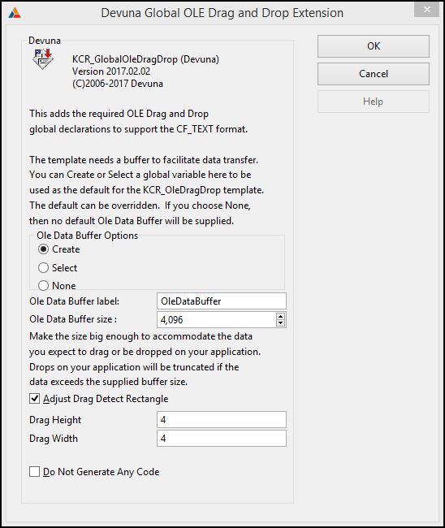
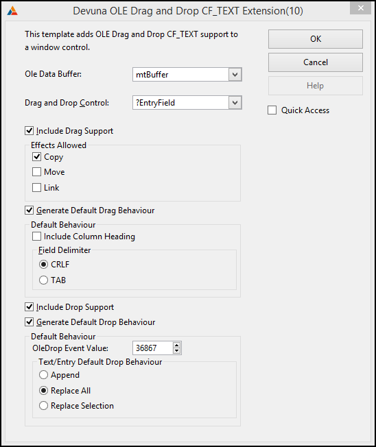

# Devuna OLE Drag and Drop #

----------

## Getting Started ##

Files normally installed in the CSIDL\_PROGRAM_FILES\SoftVelocity\Clarion10\accessory folder:

- libsrc\win\cDataObject.clw Class Implementation
- libsrc\win\cDataObject.inc Class Declarations
- template\win\OleDragDrop.tpl the templates
- images\DragDrop.ico template icon

Files normally installed in the  CSIDL\_COMMON_DOCUMENTS\SoftVelocity\Clarion10\Accessory\Devuna

- Documents\OleDragDrop\readme.txt&nbsp;&nbsp;&nbsp;- this file
- Documents\OleDragDrop\LICENSE&nbsp;&nbsp;&nbsp;&nbsp;&nbsp;- GNU GENERAL PUBLIC LICENSE Version 3
- Examples\OleDragDrop\people.app
- Examples\OleDragDrop\people.dct
- Examples\OleDragDrop\people.tps

To use the Classes and Templates with older clarion versions, you will need to copy the following Softvelocity Clarion 10 files to the appropriate libsrc folder:

- svapi.inc
- svapifnc.inc
- svcom.inc
- svcom.clw
- svcomdef.inc
- winerr.inc

## Templates ##

There are two templates in the **KCR_OleDragDrop** template set.

### KCR_GlobalOleDragDrop ###

**KCR_GlobalOleDragDrop** is the Devuna Global OLE Drag and Drop Extension template.

Add this template to the Global Extensions of your application.  ***It is required by the other template(s) in the set***.

The template has a check box to allow you to turn off code generation.
If you check this option, there will be no Ole Drag and Drop code generated in the entire application.  You can disable it at the procedure level with the next template.

### KCR_OleDragDrop ###
    
**KCR_OleDragDrop** is the Devuna OLE Drag and Drop Extension used to add Ole Drag and Drop to your procedure.  ***You need to have a local CSTRING variable to contain the drag and drop text.  Define it before populating the template***.  

This template has several prompts:

**Drag and Drop Control**&nbsp;&nbsp;&nbsp;select the control that is to be the source/target for the drag and drop. If the control you selected is also an ABC BrowseBox control the the template will automatically generate the code to set the OleData to the BrowseBox contents.

**Drag and Drop Data**&nbsp;&nbsp;&nbsp;the local CSTRING variable you created to hold the drag/drop text

**Include Drag Support**&nbsp;&nbsp;&nbsp;uncheck to disable generating code to support the drag operation

**Include Column Heading**&nbsp;&nbsp;&nbsp;if this is an ABC BrowseBox add the column headers to the OleData.

**Field Delimiter**&nbsp;&nbsp;&nbsp;choose either CRLF (Carrige Return Line Feed) or TAB as a field separator. If you are pasting into Excel, use CRLF to put the data into different rows; use TAB to put the data into different columns.

**Effects Allowed**&nbsp;&nbsp;&nbsp;these control the effects that are allowed by the drop source.  You must have at least one of these selected.  Keystate modifiers have the following standard OLE effects:

- ctrl = copy
- shift = move
- ctrl+shift = link

It is up to you to respond appropriately in your code to the returned effect after a successful drop.  For copy you don't need to do anything; for move, you would need to delete the queue entry (for a listbox) or the selected text (for text or entry controls).  Link is provided for completeness; you'll have to decide how to handle this yourself.

**Include Drop Support**&nbsp;&nbsp;&nbsp;uncheck to disable generating code to support the drop operation

**OleDrop Event Value**&nbsp;&nbsp;&nbsp;when a successful drop has been completed, the generated code will post an event back to your main window.  You can set the value for that event here; the **default is 09000h**

**Text/Entry Default Drop Behaviour**
Determines how the dropped text will affect text currently in the control.

- Append&nbsp;&nbsp;&nbsp;&nbsp;&nbsp;&nbsp;&nbsp;&nbsp;&nbsp;&nbsp;&nbsp;&nbsp;&nbsp;&nbsp;&nbsp;&nbsp;&nbsp;&nbsp;- dropped text will be appended to any text already in the control
- Replace All&nbsp;&nbsp;&nbsp;&nbsp;&nbsp;&nbsp;&nbsp;&nbsp;&nbsp;&nbsp;&nbsp;&nbsp;- replaces all text currently in the control with the dropped text
- Replace Selection&nbsp;- replaces the selected text with the dropped text

***IMPORTANT*** 
If you are using a List control as your Drag and Drop control, make sure it does not have a DRAGID or a DROPID as Clarion list box drag and drop support will cause problems.<r />
***IMPORTANT***

## Classes ##

#### Interface classes ####
There are four interface classes included in the package.  These classes are wrappers for similarly name interfaces.  Please see the **[interface documentation on MSDN](https://msdn.microsoft.com/en-us/library/windows/desktop/ms693372(v=vs.85).aspx)** for details of the interface methods.

Besides the interface methods, each interface class has several additional common methods:
 
- contruct&nbsp;&nbsp;&nbsp;- standard constructor
- destruct&nbsp;&nbsp;&nbsp;- standard destructor
- init&nbsp;&nbsp;&nbsp;&nbsp;&nbsp;&nbsp;&nbsp;&nbsp;&nbsp;&nbsp;&nbsp;- standard initialization for class. ***Must be called before other methods*** 

        IDropSourceClass.Init - no parameters

        IDropTargetClass.Init(hwnd) - pass the handle of the window that is to be the drop target

        IDataObjectClass.Init(fmtetc, stgmed, count) -  fmtetc pointer to a tagFORMATETC group array
                                                        stgmed pointer to a stgmed group array
                                                        count long number of array elements

        IEnumFORMATETCClass.Init(fmtetc, count) -       fmtetc pointer to a tagFORMATETC group array
                                                        count long number of array elements
&nbsp;
- kill&nbsp;&nbsp;&nbsp;&nbsp;&nbsp;&nbsp;&nbsp;&nbsp;&nbsp;&nbsp;&nbsp;&nbsp;&nbsp;&nbsp;&nbsp;&nbsp;&nbsp;&nbsp;&nbsp;&nbsp;&nbsp;&nbsp;&nbsp;&nbsp;&nbsp;&nbsp;&nbsp;&nbsp;&nbsp;&nbsp;- for clean up on exit
- getinterfaceobject&nbsp;&nbsp;&nbsp;&nbsp;&nbsp;&nbsp;- returns a pointer to the raw interface
- getliblocation&nbsp;&nbsp;&nbsp;&nbsp;&nbsp;&nbsp;&nbsp;&nbsp;&nbsp;&nbsp;&nbsp;&nbsp;&nbsp;- returns nothing for these classes
- _ShowErrorMessage - used by the class to display internal errors

#### OleData class ####
There is also an **OleData class** that has just one method GetOleData.
This class method is called from a subclassed winproc.  As such it runs on a different stack than your main code.  ***This means that you should only access global and module data from this procedure***.

The GetOleData method is called just prior to initiating the drag operation to allow you to prepare the data for transfer.  Please look at the comments and default generated code.

## Further Reading ##
If you want to know more details about how OLE Drag and Drop works, and also what I used as a guide, check out this [**Ole Drag and Drop Tutorial**](http://www.catch22.net/tuts/ole-drag-and-drop).

## Example ##

The example application is normally installed in the 
CSIDL\_COMMON_DOCUMENTS\SoftVelocity\Clarion10\Accessory\Devuna\Examples\OleDragDrop folder.

The example is the standard People App with Ole Drag and Drop support added to the people browse.

